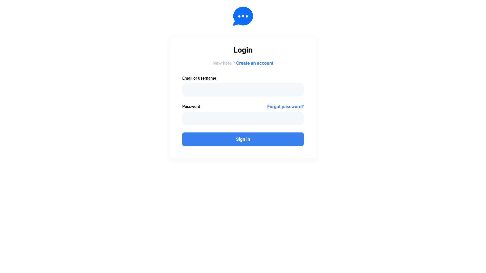
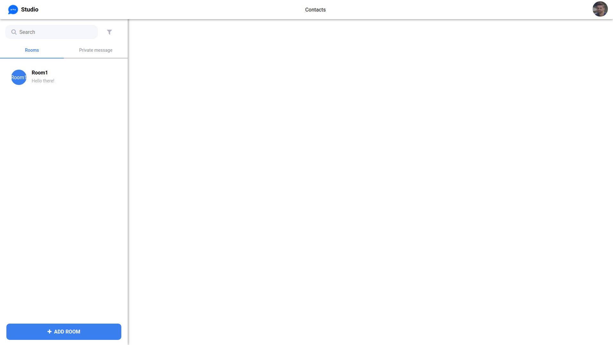
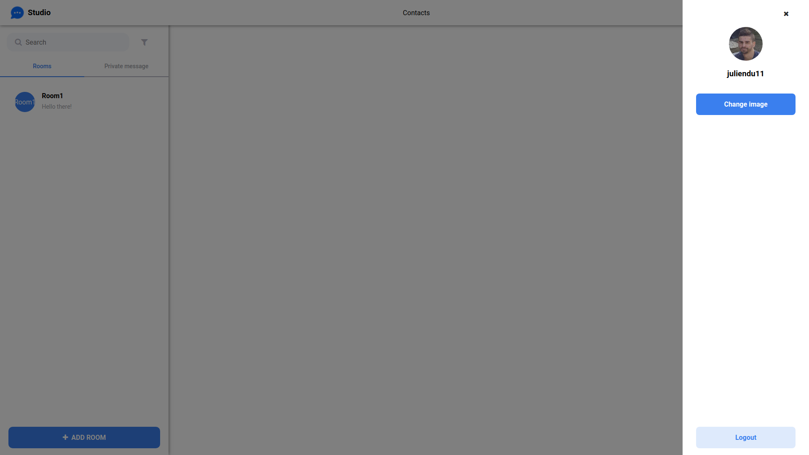
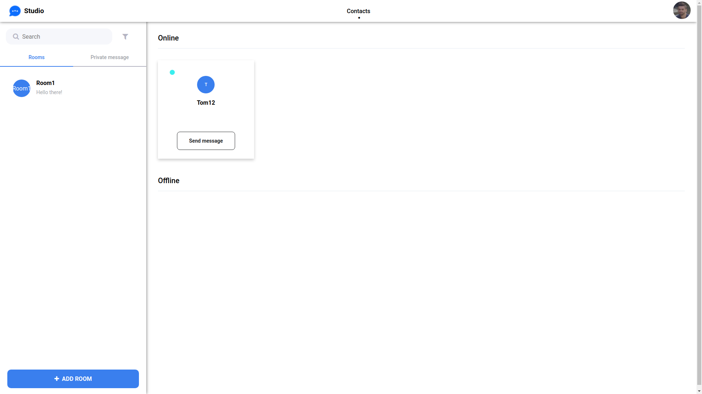
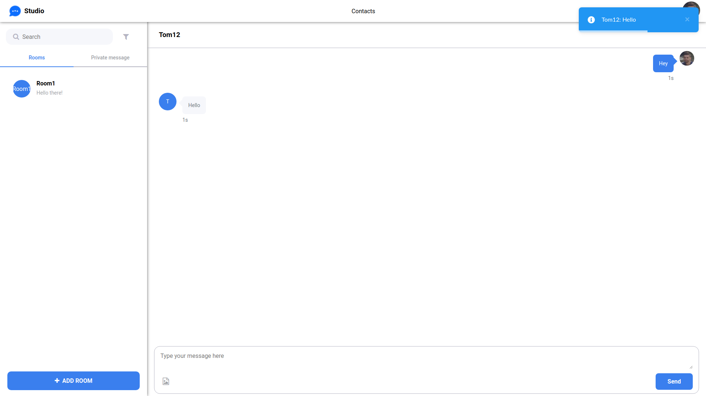
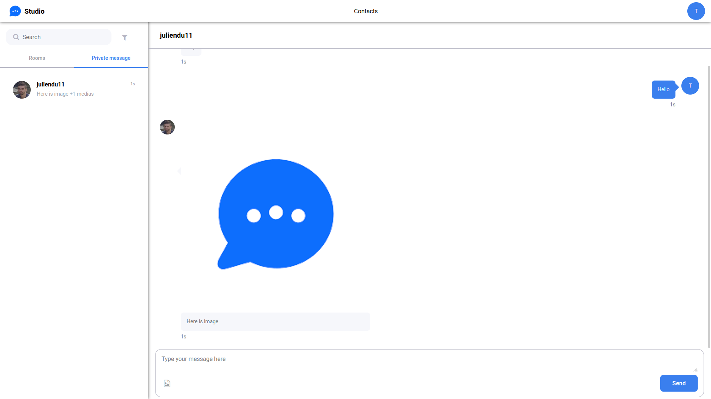
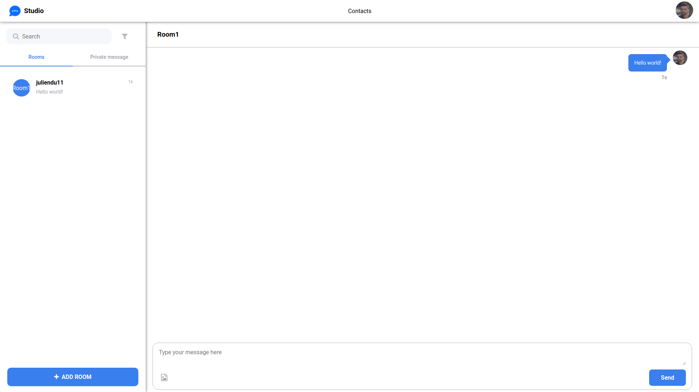
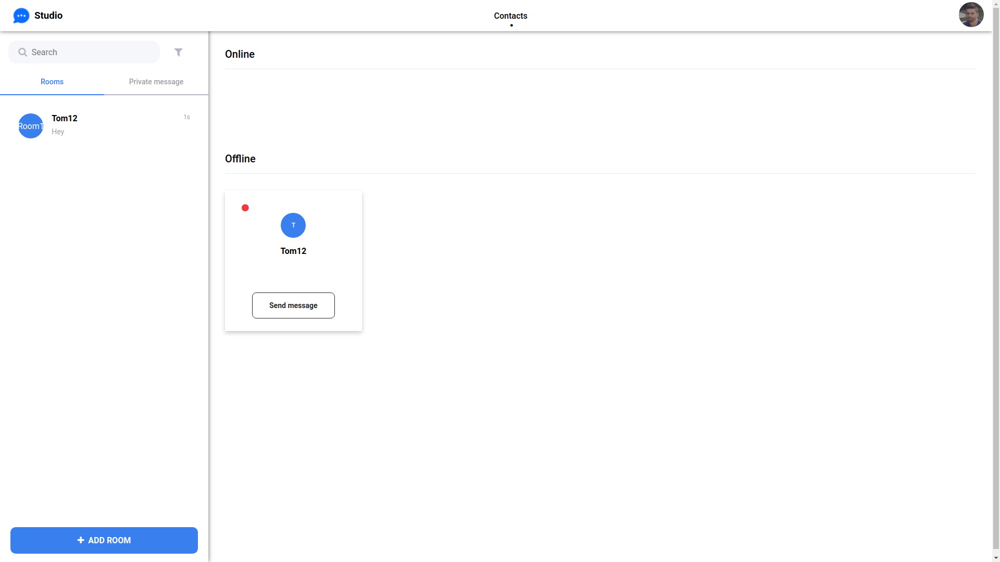

## Description

Frontent with Vue JS 3 with vue-cli + Typescript for a real-time chat application. The application aims to add a "big" real projects for my portfolio.

<a href="https://github.com/juliendu11/chat-application-back-nestjs">Go to Backend part</a>

Strongly inspired by https://dribbble.com/shots/13946594-Omni-channel-Conversation/attachments/5558081?mode=media

## Preview











## Installing

Launch the frontend then run this command:

```bash
$ npm run serve
```

## Production

Before build modify the link in the src/service-worker.js file by the link of your site

```javascript
if (windowClient.url.includes('https://MyWebSite.com/') && windowClient.visibilityState === 'visible') {
    clientIsVisible = true
    break
}
```


Run this command to build project:

```bash
$ npm run build
```

<b> :warning: Push notifications only work for production mode! Build the project and serve the files in dist</b>

## Features

- [X] Login/Register/Forgot Password/Reset Password
- [X] Send mail for confirm account and password management
- [X] Refresh token (with 2 week validity)
- [X] Room management (create, send message)
- [X] Conversation management (view conv, send message, subscription when new message)
- [X] Sending images
- [X] Sending videos
- [ ] Sending vocal
- [ ] Direct cam visio
- [X] Contacts management (online, offline list with subscription)
- [X] Update profil image
- [ ] Option for sub message room
- [ ] Video reader
- [X] Push notification PWA (for private message only if app is closed or if app not focused)

- [ ] Unit tests
- [ ] Integrations tests
